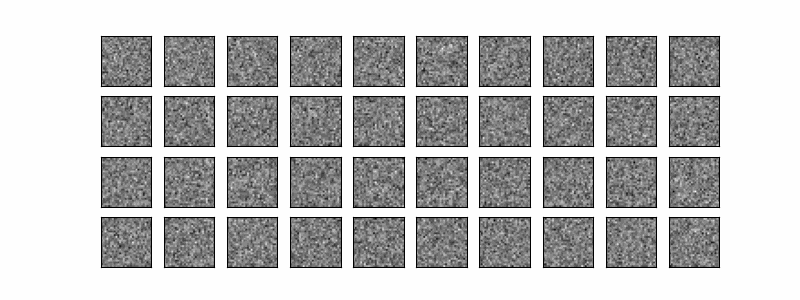
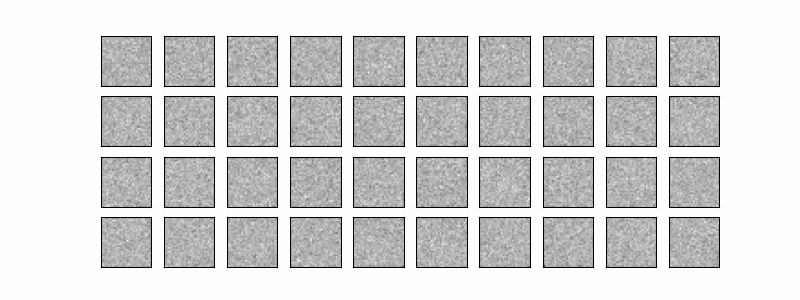
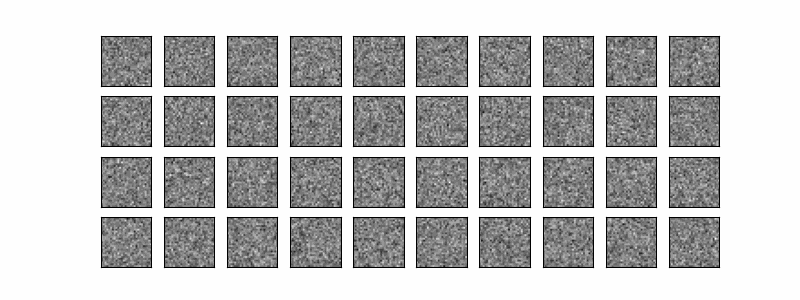
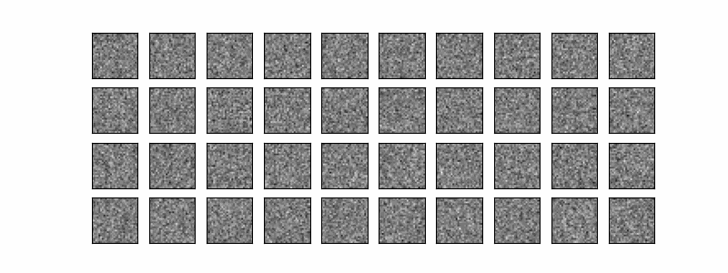

# DDPM Results

1. `epsilon` prediction and `linear` beta scheduling

2. `epsilon` prediction and `cosine` beta scheduling

3. `sample` prediction and `linear` beta scheduling

4. `sample` prediction and `cosine` beta scheduling

